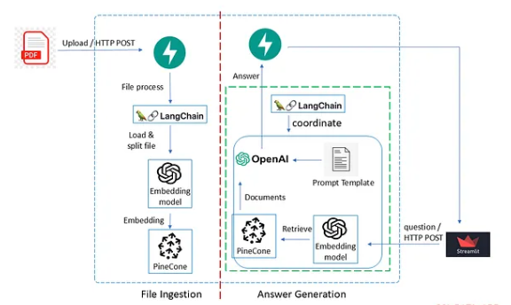

# LangGraph Agentic Chatbot: AI with LangChain

This repository implements a production-ready **agentic AI chatbot** powered by **LangChain** and **LangGraph**. It combines semantic Retrieval-Augmented Generation (RAG) with dynamic workflow orchestration, enabling the system to intelligently route queries, retrieve relevant context from documents or the web, evaluate responses for quality and groundedness, and iterate as needed.



- **Part 1**: Building a Semantic RAG Pipeline (PDF ingestion, embeddings, Pinecone vector store, FastAPI backend, Streamlit frontend).
- **Part 2**: Orchestrating workflows with LangGraph (conditional routing, loops, LLM-driven decisions, graders).

## Features

- **PDF Document Ingestion**: Upload PDFs → extract text → chunk semantically → embed and store in Pinecone.
- **Hybrid Retrieval**: Combines vector similarity search (RAG) with Tavily web search.
- **Agentic Workflow via LangGraph**:
  - LLM-powered routing (agent-related queries → RAG; general queries → web search).
  - Document relevance grading.
  - Hallucination and answer relevance checks.
  - Conditional branching and retry loops for higher-quality responses.
- **FastAPI Backend**: Endpoints for file upload and query generation.
- **Streamlit Frontend**: Interactive chatbot interface.
- **Observability**: LangSmith tracing support.
- **Testing**: Unit tests for chains and graph components.

## Tech Stack

- **LangChain** + **LangGraph** (core orchestration)
- **OpenAI** (GPT-4o-mini for generation, text-embedding-3-small for embeddings)
- **Pinecone** (vector database)
- **FastAPI** (backend API)
- **Streamlit** (chatbot UI)
- **Tavily** (web search)
- **Pydantic**, **aiofiles**, and other Python utilities

## Project Structure

```text
Langgraph_chatbot/
├── rag_process/
│   ├── __init__.py
│   ├── extractor.py
|   └── service.py
│   
├── graphs
│   │── chains.py       # llm chains
│   ├── nodes.py        # graph nodes. Defined as Python functions
│   ├── graph.py        # graph workflow  
│   ├── consts.py       # define node names as constants
│   └── state.py        # typed dictionary to store graph states            
|── schemas.py          # pydantic data models 
|── upload.py           # python functions to upload files asynchronously
├── main.py             # fastAPI app 
├── config.py           # pydantic BaseConfig
│── dependencies.py     # dependency inject to fastAPI endpoint function
├── test_chains.py      # pytests
├── .env.example        # environment variable definition
├── client.py           # streamlit client           
├── .gitignore
└── requirements.txt    # package requirements
```

## Quick Start

### 1. Prerequisites

- Python 3.10+
- API keys for: OpenAI, Pinecone, Tavily, LangSmith (optional but recommended)

### 1.1 pinecone API key from Pinecone console
- Go to Pinecone console https://www.pinecone.io/
- Click on "Get API Key" in the top-right corner.
- Copy the API key and paste it in the .env file.

1. Log in to your Pinecone Console.
2. Click Create Index.
3. Use the following settings:
   - Index Name: knowledgebase
   - Dimensions: 1536 (this must match the text-embedding-3-small model dimensions)
   - Metric: cosine
   - Type: Serverless (e.g., AWS us-east-1 or your preferred region)
4. Click Create Index.

### 2. Installation

```bash
git clone https://github.com/Gkodkod/Langgraph_chatbot.git
cd Langgraph_chatbot
```

```bash
# or with PIP (install / update dependencies )
pip install -r requirements.txt
# activate venv
.venv\Scripts\Activate.ps1
```

```bash
# OR with UV (install / update dependencies )
uv sync
# activate venv
.venv\Scripts\Activate.ps1
```

### 3. Configuration

Copy `.env.example` to `.env` and fill in your API keys:

```bash
cp .env.example .env
```

Required variables in `.env`:

```text
OPENAI_API_KEY="<Your OpenAI API Key>"
VECTOR_DB=pinecone
Hugging_Face_TOKEN=<your huggingface token>
PINECONE_API_KEY=<your Pinecone API Key>
PINECONE_ENVIRONMENT=gcp-starter
LANGSMITH_TRACING=true
LANGSMITH_ENDPOINT="https://api.smith.langchain.com"
LANGSMITH_API_KEY="<Your LangSmith API Key"
LANGSMITH_PROJECT="agent-ai"
TAVILY_API_KEY=<Your TAVILY API Key>
```

## Running the Application

### Backend (FastAPI)

```bash
# with venv
uvicorn main:app --reload

# Run the FastAPI backend
uv run uvicorn main:app --reload
```

### Frontend (Streamlit)

```bash
streamlit run client.py

# with uv
uv run streamlit run client.py      # Run Streamlit frontend

```

## Testing

Run unit tests with `pytest`:

```bash
pytest

# with uv
uv run pytest                       # Run tests
```

The project includes tests for the chains and graph components to ensure reliability. For more detailed test results and coverage information, you can refer to the test documentation or run the tests with coverage reporting flags.

### NOTE

Why this happens so quickly:
This project uses LangGraph (Agentic AI), which means the AI makes many decisions per chat message behind the scenes. For a single question, the server does all of this:

1. Calls the LLM to rephrase the question.
2. Calls the LLM 3 separate times to "grade" 3 retrieved documents.
3. Calls the LLM to generate an answer.
4. Calls the LLM to check if it hallucinated.
5. If it hallucinated, it repeats the process with a Web Search!

That is up to 10 separate API calls to LLMs just to answer ONE of your questions!

If your LLM's tier has a very strict limit of 30 Requests Per Minute, asking two or three questions in a row completely exhausts your quota, crashing the app. So I highly recomend you to use the paid API key for LLM.

### Contributing

Contributions are welcome. Please fork the repository and submit pull requests with clear descriptions of changes.

### License

This project is for educational and demonstration purposes.

MIT License. Copyright (c) 2026 Gal Levinshtein

This project is a great learning resource for understanding RAG and LangGraph concepts. However, the author assumes no responsibility for any errors, omissions, or damages resulting from the use of this project. Users should exercise their own judgment and verify any information obtained from this project.
